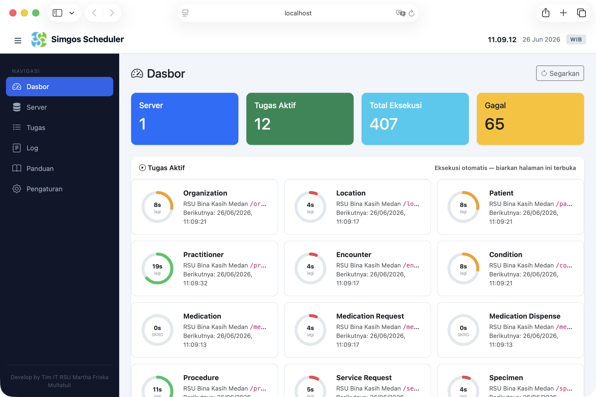

# Simgos Scheduler Web Based

Scheduler API berbasis web dengan indikator **donut countdown** untuk memonitor dan mengeksekusi task secara otomatis. Backend menggunakan **PHP native**, **HTML5** frontend **Bootstrap + vanilla JS**, berjalan di **Docker**.



> Task dieksekusi melalui browser (dashboard), tanpa background daemon/scheduler.

---

## Fitur

- **Dashboard** — daftar task aktif dengan donut countdown, statistik, dan log eksekusi terbaru
- **Server** — kelola server tujuan API (nama + base URL)
- **Tugas** — buat/ubah/salin/hapus task, atur interval & timeout
- **Log** — riwayat eksekusi dengan filter status, detail respons API + pretty print
- **Pengaturan** — ubah zona waktu (WIB default), semua data tersimpan di UTC
- **Panduan Penggunaan** — petunjuk langkah demi langkah
- **Ekspor/Impor** — start/stop semua task atau task terpilih

## Persyaratan

- [Docker](https://docs.docker.com/get-docker/) & [Docker Compose](https://docs.docker.com/compose/install/)
- Port **8080** (web) dan **3307** (MySQL) tidak dipakai

## Cara Menjalankan

```bash
# Clone
git clone https://github.com/rezalaga/Simgos-Scheduler-Web-Based.git
cd Simgos-Scheduler-Web-Based

# Jalankan
docker compose up -d

# Buka di browser
open http://localhost:8080
```

Container akan:
- Membuat database `api_scheduler` + tabel (servers, tasks, logs, settings)
- Menjalankan Apache + PHP 8.2 di port 8080
- Menjalankan MySQL 8 di port 3307

## Struktur Folder

```
.
├── docker-compose.yml      # Definisi service web + db
├── Dockerfile              # php:8.2-apache + pdo_mysql + curl
├── init.sql                # Skema database awal
├── .gitignore
├── README.md
└── www/
    ├── index.php           # Entry point: routing API + halaman HTML
    ├── config.php          # Koneksi PDO + timezone dari DB
    ├── assets/
    │   ├── css/
    │   │   └── style.css   # CSS kustom (sidebar, donut, topbar)
    │   ├── js/
    │   │   └── app.js      # Logika frontend (dashboard, donut, dll)
    │   └── images/
    │       ├── simgos-logo.png
    │       └── screenshot.png
```

## Teknologi

| Bagian      | Teknologi                          |
|-------------|-------------------------------------|
| Backend     | PHP 8.2 native, PDO MySQL           |
| Frontend    | HTML5, Bootstrap 5.3, vanilla JS    |
| Database    | MySQL 8                             |
| Container   | Docker, docker-compose              |
| HTTP Client | cURL (eksekusi task)                |
| Grafik      | SVG donut (stroke-dasharray/offset) |
| Icon        | Bootstrap Icons                     |

## Catatan

- **Halaman Dashboard harus tetap terbuka** agar task berjalan otomatis (JS `setInterval` 1s)
- Setelah perubahan JS, lakukan **Cmd+Shift+R** (hard refresh)
- Semua waktu tersimpan dalam zona waktu yang dipilih di database
- Task menggunakan metode **GET** (header & body tidak diperlukan)
- `scheduler.php` tidak digunakan — file referensi saja

## Pengembang

**Tim IT RSU Martha Friska Multatuli**

## Lisensi

Hak cipta © 2026 - **RSU Martha Friska Multatuli**. Dikembangkan untuk keperluan internal.

Repo ini bersifat **open source** — siapa pun boleh menggunakan, mengembangkan, memodifikasi, dan mendistribusikan ulang.
